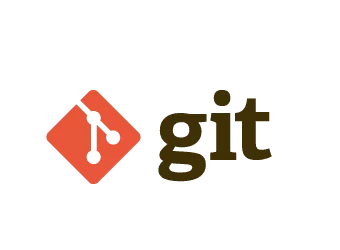

# 📚 Guia de Git, GitHub e Markdown


---

# 📑 Índice

- [📌 Objetivo](#-objetivo)
- [🛠 Tecnologias Utilizadas](#-tecnologias-utilizadas)
- [📂 Estrutura das Pastas](#-estrutura-das-pastas)
- [🚀 Como Executar](#-como-executar)
- [📖 Introdução](#-introdução)
- [🔧 Git](#-git)
- [🐙 GitHub](#-github)
- [🌿 Branches](#-branches)
- [🔀 Merge](#-merge)
- [📬 Pull Request](#-pull-request)
- [💻 Exemplos de Comandos](#-exemplos-de-comandos)
- [✅ Checklist](#-checklist)
- [📊 Tabela de Tecnologias](#-tabela-de-tecnologias)
- [💡 Citação](#-citação)
- [✨ Recursos Extras do Markdown](#-recursos-extras-do-markdown)
- [👨‍💻 Autor](#-autor)

---

# 📌 Objetivo

Este markdown foi desenvolvido para reunir conceitos fundamentais sobre **Git**, **GitHub**, **Branches**, **Merge** e **Pull Request**, além de demonstrar os principais recursos da linguagem **Markdown** utilizados na documentação de projetos.

---

# 🛠 Tecnologias Utilizadas

- **Git**
- **GitHub**
- **Markdown**
- **Visual Studio Code**
- **Git Bash**

---

# 📂 Estrutura das Pastas

```text
📦 Projeto
├── README.md
├── imagens/
│   ├── git.png
│   └── github.png
├── exemplos de código/
│   └── pyton.py
└── documentos/
    └──Controlando-versões-com-Git-e-Github.pdf
```

---

# 🚀 Como Executar

1. Clone o repositório.

```bash
git clone https://github.com/seu-usuario/seu-repositorio.git
```

2. Entre na pasta.

```bash
cd seu-repositorio
```

3. Abra o projeto no VS Code.

```bash
code .
```

---

# 📖 Introdução

O **Git** é um sistema de controle de versão distribuído que permite acompanhar alterações em arquivos.

Já o **GitHub** é uma plataforma online utilizada para hospedar projetos Git, facilitando o trabalho colaborativo.

### Principais vantagens

- ✔ Controle de versões
- ✔ Trabalho em equipe
- ✔ Histórico de alterações
- ✔ Segurança dos arquivos
- ✔ Organização do desenvolvimento

---

#  Git  

Git é um software criado por **Linus Torvalds** para controlar versões de código.

## Principais características

- Versionamento distribuído
- Histórico completo
- Branches rápidas
- Merge eficiente
- Open Source

### Fluxo básico

```text
Working Directory
        ↓
git add
        ↓
Staging Area
        ↓
git commit
        ↓
Repository
```

---

#  GitHub 

GitHub é uma plataforma baseada em nuvem utilizada para armazenar projetos Git.

### Recursos

- Repositórios
- Pull Requests
- Issues
- Wiki
- Actions
- Projects

---

# 🌿 Branches

Uma **Branch** representa uma linha independente de desenvolvimento.

Exemplos:

- `main`
- `develop`
- `feature/login`
- `bugfix/header`

Criando uma branch:

```bash
git branch minha-branch
```

Mudando para ela:

```bash
git checkout minha-branch
```

Ou:

```bash
git switch minha-branch
```

---

# 🔀 Merge

Merge significa unir alterações de diferentes branches.

Exemplo:

```bash
git checkout main
git merge minha-branch
```

Benefícios:

- Integra funcionalidades
- Mantém histórico
- Evita perda de código

---

# 📬 Pull Request

O Pull Request (PR) permite solicitar que alterações sejam revisadas antes da integração.

Etapas:

1. Criar uma branch.
2. Desenvolver.
3. Fazer commit.
4. Enviar para GitHub.
5. Abrir Pull Request.
6. Revisão.
7. Merge.

---

# 💻 Exemplos de Comandos

## 📁 Terminal

```bash
mkdir projeto
cd projeto
dir
```

---

##  Git

Inicializar repositório

```bash
git init
```

Adicionar arquivos

```bash
git add .
```

Criar commit

```bash
git commit -m "Primeiro commit"
```

Ver histórico

```bash
git log
```

Ver status

```bash
git status
```

Enviar ao GitHub

```bash
git push origin main
```

Atualizar repositório

```bash
git pull origin main
```

---

## 🐍 Python

```python
print("Olá, GitHub!")

for i in range(5):
    print(i)
```
[Exemplo de código em Pyton](exemplo-de-código/pyton.py)
---

# ✅ Checklist

## Atividades

- [x] Criar repositório
- [x] Configurar Git
- [x] Criar README
- [x] Adicionar Markdown
- [x] Criar Branch
- [x] Fazer Merge
- [x] Criar Pull Request
- [x] Adicionar Badges
- [x] Criar Índice
- [x] Inserir Citação
- [x] Adicionar Recursos Extras

---

# 📊 Tabela de Tecnologias

| Tecnologia | Finalidade | Nível de conhecimento |
|------------|------------|-----------------------|
| Git | Controle de versão | Básico |
| GitHub | Hospedagem de código | Básico |
| Markdown | Documentação | Básico |
| VS Code | Editor de código | Intermediário |
| Git Bash | Terminal Git | Básico |

---

# 💡 Citação

> **"Programas devem ser escritos para pessoas lerem e apenas incidentalmente para máquinas executarem."**
>
> *Harold Abelson*

---

# ✨ Recursos Extras do Markdown

Além dos recursos solicitados, este README utiliza:

## 1. Texto riscado

~~Texto removido~~

---

## 2. Texto destacado

==Este texto pode ser destacado em alguns renderizadores Markdown.==

---

## 3. HTML no Markdown

<kbd>CTRL</kbd> + <kbd>C</kbd>

<br>

<mark>Texto marcado usando HTML.</mark>

---

## 4. Detalhes expansíveis

<details>

<summary><strong>Clique para expandir</strong></summary>

Este conteúdo fica oculto até o usuário clicar.

- Git
- GitHub
- Markdown
- Branches
- Merge

</details>

---

## 5. Imagem clicável

Clique na imagem abaixo:

<a href="https://github.com">

</a>

---

## 6. Emojis

🚀 📚 💻 🔥 ✅ 🎯

---

## 7. Linha horizontal

---

## 8. Âncoras

Voltar ao [Índice](#-índice)

---

## 9. Documento em PDF

Baixe o [Material Controlando versões com Git e Github em PDF](documentos/Controlando-versões-com-Git-e-Github.pdf).

# 👨‍💻 Autor

**Jefferson Santino**


Desenvolvido como atividade prática para estudos de **Git**, **GitHub** e **Markdown**.
